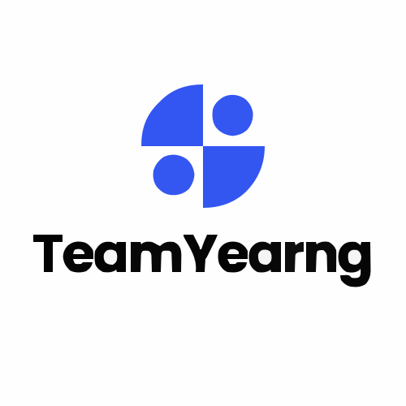

<p align="center">
  
</p>

<h1 align="center">TeamYearng</h1>

TeamYearng is a development team specializing in building modern, scalable, and reliable digital solutions for businesses, schools, organizations, and individuals.  
We focus on delivering high-quality systems, applications, and IT services with a strong emphasis on performance, usability, and long-term support.

---

## 👥 Team Members

- **THO Panha** – Full-stack Developer / Mobile Developer
- **BY Vibol** – Backend Developer / System Analyst
- **ROTH Angkeamanet** – UI/UX Designer / Full-stack Developer
- **Pim Panharith** – Flutter Developer / Project Support / Full-stack Developer

---

## 🧩 What We Build

### ✅ Point of Sale (POS) Systems

Complete POS solutions for shops, restaurants, cafés, and retail businesses:

- Product & stock management
- Billing & receipt system
- Sales reports & analytics
- Multi-user & role-based access

### ✅ School Management & Library Systems

Smart, easy-to-use systems for educational institutions:

- Student & teacher management
- Attendance tracking
- Course & exam management
- Library book borrowing & return system
- Admin dashboard & report generation

### ✅ Mobile Apps (Education & Business)

We develop modern mobile apps for Android & iOS:

- Education apps
- Student portals
- Business management apps
- Custom apps based on client requirements

---

## 🛠️ Services We Provide

### 💻 Website Development

Responsive, SEO-optimized websites using:

- React / Vue
- Laravel / Node.js
- TailwindCSS / Bootstrap

### 🖥️ System Development

Custom systems tailored to business needs:

- Inventory system
- HR & payroll system
- CRM / ERP
- POS & school system

### 📱 Mobile App Development

Cross-platform mobile apps using Flutter.

### 🖥️ Server Configuration & Deployment

We help businesses set up secure and stable servers:

- Server installation & configuration
- Nginx setup (reverse proxy, optimization, SSL, caching)
- Domain + hosting setup
- Deployment automation

---

## ⚙️ Technologies Used

- **Frontend:** React, Vue, Vite, TailwindCSS, Bootstrap, Next.js, Nuxt.js
- **Backend:** Node.js, Express, Laravel, PHP
- **Mobile:** Flutter
- **Database:** MySQL, PostgreSQL
- **Server:** Nginx, Ubuntu Server, Docker

---

## 🌐 Our Mission

To deliver simple, powerful, and scalable digital solutions that help businesses and schools modernize their workflows and grow through technology.

---

## 🚀 Run Project

---

### 🐳 Docker (Production Build)

Build the Docker image:

```bash
docker build -t teamyearng-frontend .
```

Run the Docker container:

```bash
docker run -d -p 80:80 teamyearng-frontend
```

The application will be available at `http://localhost:8080`.

### 🛠️ Local Development

Install dependencies:

```bash
npm install
```

Start the development server:

```bash
npm run dev
```

The application will be available at `http://localhost:5173`.
